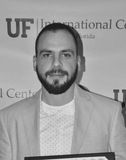
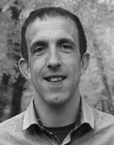
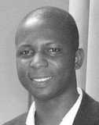
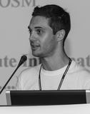
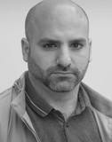

<h2 id="sotm">State of the Map</h2>

State of the Map 2019 is taking place from September 21st to 23rd 2019 in Heidelberg.

<!--
We are looking forward to designing a program with you - the OpenStreetMap community. Expect a call for session proposals to go out soon - <a href="{{site.baseurl}}/#newsletter">sign up for event updates</a> to get a notification.

For the second time, State of the Map will have a parallel Academic Track to showcase scientific contributions on OSM.
-->

The program will allow attendants to present and learn about latest developments in OpenStreetMap in presentations, lightning talks as well as workshops and birds of a feather sessions. Additionally, for the second time, State of the Map will host a parallel Academic Track to showcase scientific contributions on OSM.

We are looking forward to further designing our program with you and welcome your thoughts and ideas. If you are interested in joining the program committee or if you have any suggestions, please feel free to <a href="mailto:sotm@openstreetmap.org">get in touch with us</a>.

## Academic Track

We expect to share our call for academic and general session proposals in the beginning of 2019 - <a href="{{site.baseurl}}/#newsletter">sign up to our newsletter</a> for event updates.

### Academic Committee

You can reach the academic track committee via email to <a href="mailto:academic-sotm@openstreetmap.org">academic-sotm@openstreetmap.org</a>.

* 
  <em>Dr. Levente Juhász</em> 
  GIS Center, Florida International University, USA

  Levente, originally from Hungary, earned his PhD from the University of Florida. Currently he is with the GIS Center at the Florida International University in Miami, Florida. Previously, he was a visiting scientist at the Joint Research Centre in Ispra, Italy, at Carinthia University of Applied Sciences in Austria and he also served as a data scientist for a geospatial startup, Mapillary. His research interests revolve around understanding the nature of user-generated geodata.

* 
  <em>Dr. Peter Mooney</em> 
  Department of Computer Science, Maynooth University, Ireland

  Peter is a tenure track lecturer at the Department of Computer Science in Maynooth University in Ireland. Peter is recognised as one of the foremost experts in Europe on Crowdsourcing Geographic Information (CGI) and Volunteered Geographic Information (VGI). He has carried out extensive research on OpenStreetMap and other forms of VGI. He is author or co-author of over 40 peer-reviewed journal publications and over 100 conference publications. Peter uses OpenStreetMap extensively in his undergraduate and postgraduate teaching. In other duties he is co-chair of the Irish OSGeo Local chapter and European Co-Chair for GeoForAll. He has been involved in the academic and scientific committees for all major GIS conferences both in Europe and globally.

* 
  <em>Dr. Godwin Yeboah</em> 
  Institute for Global Sustainable Development,
University of Warwick, UK

  Godwin is a Senior Research Fellow in Geographical Information Science with an interest in the assessment of, and contribution to, OpenStreetMap data and associated technologies for scientific research and sustainable development. He is a fellow of the Royal Geographical Society (with the Institute of British Geographers).

* 
  <em>Dr. Marco Minghini</em> 
  European Commission Joint Research Centre, Ispra, Italy

  Marco studied at Politecnico di Milano, where he got a BSc and a MSc in Environmental Engineering with specialization in Geomatics and a PhD in GIS. After 4 years spent working as a Postdoctoral Research Fellow in the GIS group of GEOlab at Politecnico di Milano, he has recently joined the European Commission - Joint Research Center (JRC) in Ispra, Italy (Unit B6 "Digital Economy"), where he makes applied research on SDIs and the implementation of the INSPIRE Directive. Marco is an advocate of open source software an open data and has a long research experience in OSM. He is a Charter Member of OSGeo, Secretary of ISPRS WG IV/4 "Collaborative Crowdsourced Cloud Mapping (C3M)", Member of the OpenStreetMap Foundation and Voting Member of HOT.

* 
  <em>Dr. A. Yair Grinberger</em> 
  GIScience Research Group, Heidelberg University, Germany

  Yair earned his PhD in Geography from the Hebrew University of Jerusalem, studying human mobility behaviors using GPS traces. His current research focuses on modelling and quantitatively analyzing socio-cultural processes of data production and their traces in Volunteered Geographical Information datasets. His broader research interests include Geographic Information Science, critical GIS, and digital representations of socio-geographical phenomena.

 

*Your State of the Map organizing team.*
